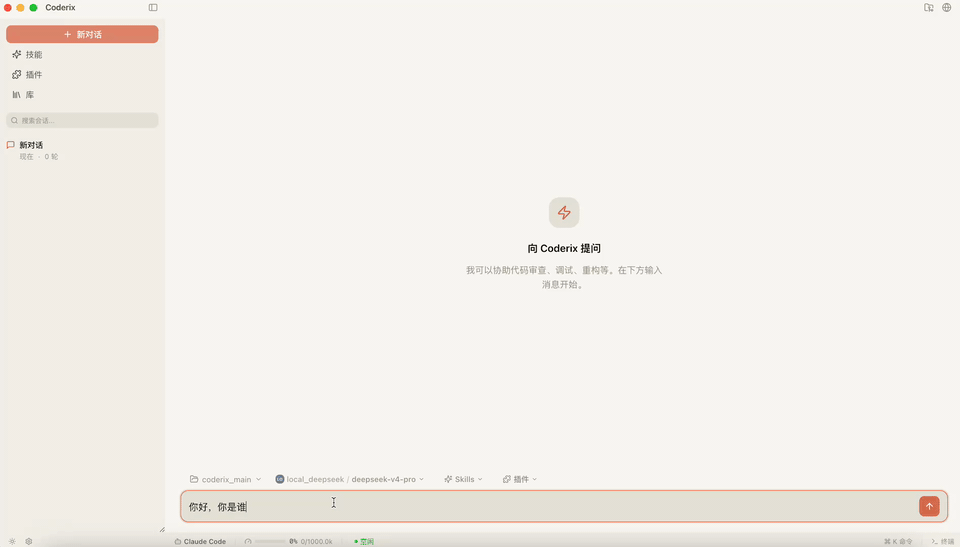

# Coderix

<div align="center">

[](LICENSE)
[](https://nodejs.org)
[](https://pnpm.io)
[](https://www.typescriptlang.org/)
[](README.md)

**一个开源的终端 / 桌面 AI 编程助手 —— 面向研究与学习的项目。**

</div>

<div align="center">
  <details open>
    <summary><b>桌面版</b></summary>
    
  </details>
  <details>
    <summary><b>终端版</b></summary>
    
  </details>
</div>

Coderix 是一个 AI 编程助手，可在终端或桌面应用中使用。它能够读取、写入、编辑文件，执行 Shell 命令，搜索代码等等——全部通过自然语言对话完成。同一套核心引擎驱动多个前端：Ink/React 终端界面（TUI）、Electron 桌面应用（React DOM + Monaco + xterm）、VS Code 扩展，以及 TypeScript / Python SDK。

---

## 定位与用途

Coderix 是一个**独立、开源、面向研究与学习**的项目——用来研究 LLM 编程助手是如何构建的：Agent 循环、工具执行、上下文管理、权限系统与多智能体编排。

- 本项目**与 Anthropic 无任何关联，未获其背书或赞助**。文中提及 "Claude Code" 仅为对比说明，Coderix 不是 Anthropic 的产品。
- 本项目面向**研究、教学与个人实验**用途。
- 支持的模型提供商：Anthropic、DeepSeek，以及任意 OpenAI 兼容接口——自带 API Key。

---

## 仓库结构

Coderix 是一个 [pnpm](https://pnpm.io) monorepo：

| 包 | 说明 |
|---|---|
| `packages/coderix-core` | 与框架无关的核心引擎 —— 查询循环、工具、上下文、Provider |
| `packages/coderix-cli` | CLI 入口 + Ink/React 终端界面 |
| `packages/coderix-tui` | 可复用的终端 UI 原语 |
| `packages/coderix-desktop` | Electron 桌面应用（React DOM + Monaco + xterm） |
| `packages/coderix-vscode` | VS Code 扩展 |
| `packages/coderix-sdk` | TypeScript SDK |
| `packages/coderix-sdk-python` | Python SDK |

---

## 快速开始

### 环境要求

- **Node.js >= 22**
- **[pnpm](https://pnpm.io/installation)** —— 本仓库是基于 pnpm 的 workspace
- 一个 API Key：[Anthropic](https://console.anthropic.com)、[DeepSeek](https://platform.deepseek.com) 或 [OpenAI](https://platform.openai.com)

### 安装

```bash
git clone https://github.com/AgenticMatrix/coderix.git
cd coderix

./install.sh --local      # 仅 CLI
./install.sh --desktop    # 仅桌面版
./install.sh --all        # 两者都装
```

### 开发模式

Coderix 提供多种界面，共用同一套核心引擎：

| 命令 | 界面 |
|---|---|
| `pnpm run dev:cli` | **TUI 版** —— 终端界面（Ink/React） |
| `pnpm run dev:desk` | **桌面版** —— Electron 应用（React DOM） |
| `pnpm run dev:vscode` | **VS Code 扩展** |

```bash
# TUI 版（终端界面）
pnpm run dev:cli

# 桌面版（Electron）
pnpm run dev:desk

# 桌面版（一键启动，自动释放 5173 端口）
./start_desk.sh

# VS Code 扩展
pnpm run dev:vscode
```

其他常用脚本：`pnpm run build`（core + cli）、`pnpm run build:all`（含 vscode）、`pnpm run typecheck`、`pnpm test`。

### 配置

```bash
# 首次运行配置向导
coderix setup

# 或者手动编辑 ~/.coderix/settings.json
```

### 开始使用

```bash
# 交互式会话
coderix

# 单次查询
coderix --print "解释 coderix-core 里的 Agent 循环"

# 切换模型
coderix --model
coderix -m "deepseek/deepseek-v4-pro"
```

---

## 功能特性

- **精美的终端界面** — 基于 [Ink](https://github.com/vadimdemedes/ink) + React 19 构建，完全终端渲染
- **多模型支持** — Anthropic (Claude)、DeepSeek、OpenAI 兼容接口
- **15+ 内置工具** — 读取、写入、编辑、Shell 执行、代码搜索、文件搜索、网页抓取、网页搜索、任务管理、待办事项
- **流式工具队列** — 工具在 LLM 流式解析时即时加入队列并执行，支持有界并发（默认 32）
- **流式输出** — 实时文本、思考过程和工具调用流式传输
- **Agent 循环** — 自主多轮推理与工具调用执行
- **权限系统** — plan / ask / auto 三种模式，按风险等级分类
- **上下文管理** — Token 预算追踪和自动压缩
- **Hook 钩子系统** — 可扩展的生命周期钩子
- **技能模块** — 可插拔的技能插件
- **会话管理** — 检查点保存、恢复（`--resume` / `--continue`）、分支会话
- **模型选择器** — 交互式终端模型选择（`coderix --model` / `coderix setup`）
- **桌面应用** — Electron 桌面客户端，内置 Monaco 编辑器、xterm 终端和源代码管理
- **VS Code 扩展** — 在编辑器中使用 Coderix
- **SDK** — 提供 TypeScript 与 Python SDK，可编程调用

---

## 键盘快捷键

| 快捷键 | 功能 |
|---|---|
| `Enter` | 发送消息 |
| `Escape` | 清空输入 / 关闭子 Agent 视图 |
| `Ctrl+C` | 中断 Agent / 终止子 Agent / 清空输入 / 双击退出 |
| `Ctrl+B` | 将子 Agent 转入后台（解除主 Agent 阻塞，子 Agent 继续运行） |
| `Ctrl+T` | 切换子 Agent 对话视图 |
| `Ctrl+P` | 切换任务和待办面板 |
| `Ctrl+O` | 展开/折叠所有内容块 |
| `Ctrl+K` | 切换团队选择器 |
| `Ctrl+Enter` | 插入换行 |
| `↑ / ↓` | 浏览输入历史 |
| `← / →` | 移动光标 |
| `Tab` | 自动补全斜杠命令 |
| `PageUp / PageDown` | 冻结 / 取消冻结显示 |

---

## 配置说明

编辑 `~/.coderix/settings.json`：

```json
{
  "model_list": [
    {
      "model": [
        {
          "name": "deepseek-v4-pro",
          "price": {
            "input": 3,
            "cache_read_input": 0.025,
            "output": 6,
            "currency": "CNY",
            "unit": 1000000,
            "concurrency": 500,
            "max_context": 1000000
          }
        },
        {
          "name": "deepseek-v4-flash",
          "price": {
            "input": 1,
            "cache_read_input": 0.02,
            "output": 2,
            "currency": "CNY",
            "unit": 1000000,
            "concurrency": 2500,
            "max_context": 1000000
          }
        }
      ],
      "provider": "deepseek",
      "base_url": "https://api.deepseek.com/anthropic",
      "auth_token_env": "你的DeepSeek API Key"
    },
    {
      "model": [
        "claude-sonnet-2025",
        "opus-4.8"
      ],
      "provider": "anthropic",
      "base_url": "https://api.anthropic.com",
      "auth_token_env": "你的Anthropic API Key",
      "price": {
        "input": 3,
        "output": 15,
        "currency": "USD",
        "unit": "1M tokens"
      }
    },
    {
      "model": [
        "gpt-5",
        "gpt-5-mini"
      ],
      "provider": "openai",
      "base_url": "https://api.openai.com/v1",
      "auth_token_env": "你的OpenAI API Key"
    }
  ],
  "default_model": "deepseek/deepseek-v4-pro",
  "max_tool_concurrency": 32,
  "theme": "dark"
}
```

---

## CLI 命令参考

| 命令 | 说明 |
|---|---|
| `coderix` | 启动交互式会话 |
| `coderix "问题"` | 单次提问 |
| `coderix --help, -h` | 显示帮助信息 |
| `coderix --version, -V` | 输出版本号 |
| `coderix --model, -m [name]` | 交互式模型选择器，或直接指定模型 |
| `coderix --setup` / `coderix setup` | 首次配置向导 |
| `coderix --print, -p <query>` | 单次查询 |
| `coderix --resume, -r [id]` | 按 ID 恢复会话，或打开会话选择器 |
| `coderix --continue, -c` | 恢复最近一次对话 |
| `coderix --gateway, -g` | JSON-RPC 网关模式（stdin/stdout） |
| `coderix --desktop, -d` | WebSocket 网关模式（供桌面应用使用） |
| `coderix --desktop-port <port>` | 桌面模式 WebSocket 端口（默认 9754） |
| `coderix --sdk` | SDK stream-json 模式（stdin/stdout，供 SDK 客户端使用） |
| `coderix --chrome-mcp` | 启动 Chrome MCP 服务器（stdin/stdout） |
| `coderix --chrome-mcp-port <n>` | Chrome 的 CDP 端口（默认 9222） |
| `coderix --computer-use-mcp` | 启动 Computer Use MCP 服务器（macOS） |
| `coderix mcp` | 管理 MCP 服务器 |

---

## 开源协议

Apache 2.0 —— 详见 [LICENSE](LICENSE)。
